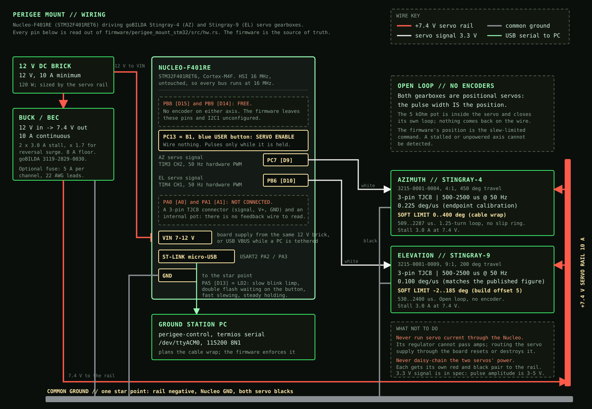

# PERIGEE mount wiring



Nucleo-F401RE (STM32F401RET6) driving two goBILDA Stingray servo gearboxes, both open loop: no
encoder is fitted on either axis, and the pulse width is the position. Every pin below is read out
of [`../src/hw.rs`](../src/hw.rs); the firmware is the
source of truth, and this table is checked against it rather than the other way round.

Vendor specs and the power sizing are in `~/.openclaw/workspace/reports/stingray-power.md`.

## Pin table

| Signal | STM32 pin | Peripheral | Arduino header | Level | Goes to |
|---|---|---|---|---|---|
| **AZ servo signal** | **PC7** | **TIM3 CH2**, AF2 | D9 | 3.3 V push-pull | Stingray-4 white lead |
| **EL servo signal** | **PB6** | **TIM4 CH1**, AF2 | D10 | 3.3 V push-pull | Stingray-9 white lead |
| PC link TX / RX | PA2 / PA3 | USART2, AF7, 115200 8N1 | ST-LINK VCP | 3.3 V | `/dev/ttyACM0` |
| **Servo enable** | **PC13** | GPIO in, pull-up | — | active low | **B1, the blue USER button. On-board; wire nothing.** |
| Status LED | PA5 | GPIO out | D13 | on-board LD2 | — |
| Board supply | VIN | — | VIN | 7–12 V | 12 V brick (or USB VBUS) |
| Ground | GND | — | GND | — | the star point |
| ~~AZ feedback~~ | ~~PA0 [A0]~~ | — | A0 | — | **nothing. Leave bare.** |
| ~~EL feedback~~ | ~~PA1 [A1]~~ | — | A1 | — | **nothing. Leave bare.** |
| (free) | PB8 / PB9 | — | D15 / D14 | — | nothing; reset state, not configured |

The Uno's D9/D10 assignment carried straight over to the Nucleo's Arduino header, which is why the
numbers look familiar. The silicon behind them is different: hardware PWM out of TIM3/TIM4 in
0.3125 µs steps, not the `Servo` library's software timing.

### Timer setup (`hw.rs` step 4)

Both timers run from the 16 MHz HSI with `PSC = 4`, so they tick at 3.2 MHz, and `ARR = 63999`
gives a 20 ms frame — 50 Hz, as the gearboxes require. A pulse is therefore set in steps of
0.3125 µs, about 0.07° on azimuth and 0.03° on elevation. Preload is on, so a new width always
starts on a frame boundary and a pulse is never truncated mid-cycle.

### The enable button (PC13)

The blue USER button is a **dead-man switch on the servo pulses**: the gearboxes are driven only
while it is held down. It needs no wiring — the Nucleo already pulls PC13 up to 3.3 V and the button
pulls it to ground — and the firmware enables the internal pull-up as well, so a pin that is somehow
left floating reads *released* and the servos stay limp. Failing open is the only safe direction for
an enable.

Both permissions are required before a pulse goes out: the button, and the serial side (`armed`,
which any move command sets and `OFF` clears). A `GO` that arrives with nobody at the board is
accepted, sets the target, and waits; pressing the button then runs the move under the usual `RATE`
limit. The button never moves an axis by itself — releasing drops the pulses where they are, pressing
picks the same pulses back up — so it is safe to use in the middle of a slew.

Each transition prints a `NOTE` line, `ID` reports `ENABLE BUTTON HELD` or `RELEASED`, and LD2
double-flashes while the firmware is armed and waiting for a thumb. The telemetry line's shape and
its `KMAE` flag letters are unchanged on purpose: perigee-control parses that letter set strictly
(`src/mount.rs`), so adding a flag for the button would make the host refuse every line, and the
host therefore needs no rebuild for this firmware.

### PA0 / PA1 are deliberately empty

These gearboxes are positional servos with a **3-position TJC8 connector (signal, V+, GND)** and a
5 kΩ pot that is internal to the servo's own control loop. There is no fourth wire and no feedback
output. The old Arduino sketch and the first STM32 build read A0/A1 as "feedback wires"; those reads
returned floating-pin noise. The ADC is now gone from the firmware entirely — not just unused, but
unclocked and unconfigured.

## Power

| Rail | Voltage | Current | Feeds |
|---|---|---|---|
| Servo rail | **7.4 V** | **10 A** | both Stingrays, nothing else |
| Board | 7–12 V into VIN, or USB VBUS | < 0.2 A | the Nucleo and its 3.3 V island |

Two rules, each of which has a way of destroying something:

1. **Each servo's red and black go straight to the rail.** Not through the Nucleo, not daisy-chained
   through each other. The board's regulator cannot pass amps; routing servo current through it
   resets or destroys the board.
2. **Common ground is mandatory.** Tie the rail negative to a Nucleo GND pin. Without it the servos
   have no reference for the pulse and behave randomly or not at all.

10 A comes from 2 × 3.0 A stall at 7.4 V, times 1.7 for brushed-DC reversal transients and inrush.
Typical tracking draw is well under 1 A total; the rating exists for the stall and reversal case.
3.3 V logic is in spec: the published pulse amplitude is 3–5 V. If a gearbox ignores the signal over
300 mm of 22 AWG lead, a 74AHCT125 buffer on 5 V fixes it — not needed to start.

## Limits, and how they are enforced

| Axis | Hardware travel | Soft window | Pulse at the window ends | Why |
|---|---|---|---|---|
| AZ (Stingray-4) | 450° | **0 … 400°** | 536 … 2313 µs | 1.25-turn cable service loop, no slip ring; 8° off the low stop so either vendor slope stays clear of both stops |
| EL (Stingray-9) | 200° | **−2 … 91°** | 530 … 1460 µs | margin off the low stop; never more than 1° past vertical (no flip-over) |

Azimuth is an **absolute, continuous, unwrapped** angle. There is no modular arithmetic on it
anywhere in the firmware, so a move from A to B always traverses `[min(A,B), max(A,B)]` and nothing
else — a command can never be satisfied "the short way round" through the cable wrap.

Enforcement is in two independent layers:

- **Host** (`perigee-control/src/mount.rs`) plans *which* wrap to use. `nearest_allowed_az` is the
  point rule; `solve_path` picks a single wrap for a whole predicted pass, and schedules an unwind
  only when the track is longer than the window.
- **Firmware** (`../src/limits.rs`) enforces the window regardless. Every pulse goes through
  `AxisCal::pulse_of`, which clamps into the mount window and then into the servo's pulse range. A
  planner bug on the host can cost a pass; it cannot reach the cable.

Beck's case, concretely: at azimuth 399 asked to point where 401 would, 401 is outside the window.
The host's only candidate is 41, so the mount unwinds 358° the other way. If the host sent 401
anyway, the firmware would answer `ERR out of window, clamped to 400.00` and stop at the limit.

`az_limit_lo_deg` / `az_limit_hi_deg` in `perigee-control/control.toml` and `AZ_CAL` / `EL_CAL` in
`../src/limits.rs` are the two places these numbers live. **They must be edited together.**

## Bench calibration, before the dish goes on

Nothing below can be checked without the hardware. All of it is unverified until Beck runs it.

1. **Measure each axis's slope inside the window.** `RAW` moves to the angle its pulse width means,
   ramped like `GO` and clamped into the soft window (`RAW AZ 500` ends at 535.56 µs), so it cannot
   reach a stop and is not meant to. Step `RAW AZ` from 600 to 2250 and `RAW EL` from 600 to 1400,
   read the angle at each step, and fit `us_per_deg` in `limits.rs`. Full procedure:
   [`calibration.md`](calibration.md) §6.3.
2. **Check the azimuth zero offset.** `AZ_CAL.offset = 8.0` assumes mount azimuth 0 sits 8° off the
   low stop. Drive `GO 0 45` and confirm there is still a visible gap to the stop; §6.4 turns the gap
   you measure into `pulse_at_zero`.
3. **Check the elevation offset.** `EL_CAL.offset = 5.0` is the built geometry. Drive `GO 200 0` and
   confirm the boresight is level. If it is not, that number is wrong and both limits move with it.
4. **Sky calibration** (`az_center_bearing_deg`, and an optional elevation correction) lives on the PC, in perigee-control's `calibration.toml`, not here: point the dish at something whose direction you know and type `/here AZ EL` in the console (or `/bearing DEG`).

## Protocol

```
PING              PONG
ID                ID PERIGEE-MOUNT fw4-stm32 PROTO T4 AZ 0-400 EL -2-91 ENABLE BUTTON HELD|RELEASED
?                 T4 tgt_az tgt_el cmd_az cmd_el set_az set_el NA -1 flags
GO az el          OK GO az el        | ERR out of window, clamped to ...
AZ deg / EL deg   OK AZ deg / OK EL deg
STOP              OK STOP            hold where the axes are now
PARK              OK PARK az el
RATE az el        OK RATE ...        slew limits, deg/s
TEL hz            OK TEL hz          telemetry rate, 0 = off
RAW AZ|EL us      OK RAW ...         move to the angle that pulse means: ramped, clamped into the window
ZERO az el        OK ZERO az el      declare where the axes really are; only while limp (OFF first)
CAL               OK CAL ...         windows and pulse endpoints
OFF               OK OFF             stop the pulses, servos go limp (and disarm)
```

On boot: `READY PERIGEE-MOUNT fw4-stm32 PROTO T4`, then either `POS <az> <el> restored, holding` or
`POS UNKNOWN: ...`, then a `NOTE` naming the enable button and its state. "Holding" now means
"holding as soon as the button is held".

Received bytes land in a 1024-byte ring by DMA, far more than perigee-control ever has in flight. If
more than that arrives before the main loop reads it (a long script pasted in one go), the firmware
says so instead of losing commands silently: `ERR receive overrun: input lost, resend`, and it drops
the partial line it was in.

**No telemetry field is a measurement.** `tgt` is the requested target after the window clamp, `cmd`
the slew-limited command that is the pulse on the wire, and `set` that command lagged by a
pessimistic servo speed model. Neither axis has an encoder, so fields 7-8 are always `NA -1`; they
stay in the line only so its shape does not change. `flags`: K position known, M moving, A / E
azimuth / elevation target clipped at the limit, `-` for none.

## Position across a reset

The last position is kept in a `.uninit` region of SRAM that the startup code does not clear, with a
magic word and a checksum. A **system reset** (the 1 s watchdog, the reset button, `probe-rs run`)
leaves SRAM intact, so the firmware restores the position and immediately holds the same pulses
instead of slewing blind or jumping on the first command. It stores the pulse widths on the wire (the servos' real position), so reflashing with new calibration constants holds the same pulse: the dish does not jump.

A **power cycle loses it.** SRAM is gone, the checksum fails, the board stays limp and reports
`POS UNKNOWN`, and refuses every move (`ERR position unknown: send ZERO az el first`) until `ZERO az el`
arrives. Surviving a power cycle would need the RTC backup registers and a VBAT cell; that is a
deliberate next step, not something this build claims.
